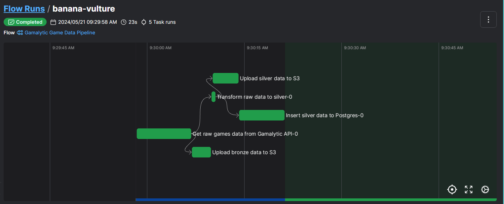
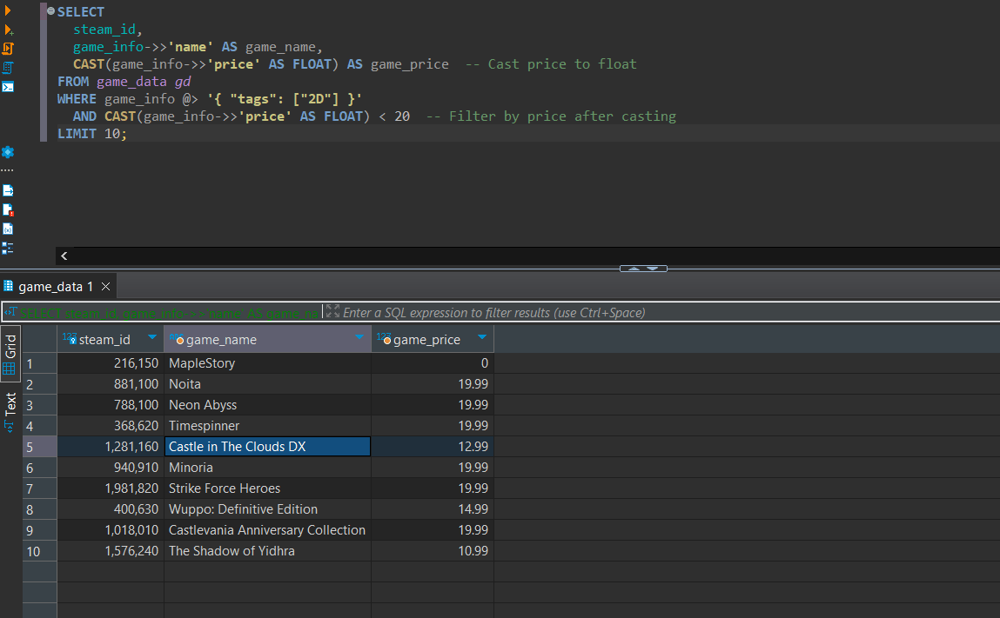

## Gamalytic ETL Flow
- Get Games from Gamalytic API (https://gamalytic.com/api-reference.txt) : Fetches game data using provided parameters (from_page, to_page, etc.)
- Upload Raw Data to S3 bucket with metadata
- Transforms bronze data into silver data (add more features, standarize format,..)
- Upload Silver Data to S3 bucket with metadata
- Perform upsert silver data to Azure PostgresSQL

**Prefect ETL Flow**
## How to run and test
- Create .env at root directory of repo. This .env file includes 8 params that are used in the data pipeline  

- Run `docker-compose up --build` in root dir
- Open Postman, pass JSON body parameters and enter this URL to test Lambda function  [http://localhost:9000/2015-03-31/functions/function/invocations](http://localhost:9000/2015-03-31/functions/function/invocations)
- API documentation and UI: https://gamalytic.com/api-reference.txt, https://gamalytic.com/game-list
```json
{
    "from_page": 0,
    "to_page": 2,
    "game_list_params": {
        "limit": 100,
        "sort_mode": "desc"
    },
    "game_filter_params": {
        "genres": "Action,RPG",
        "tags": "2D,2D Platformer"
    }
}
```
- Get data from Gamalytic API and upsert to Postgres, The Lambda function will return 200 status if it runs successfully

## Test Postgres query to retrieve game data


